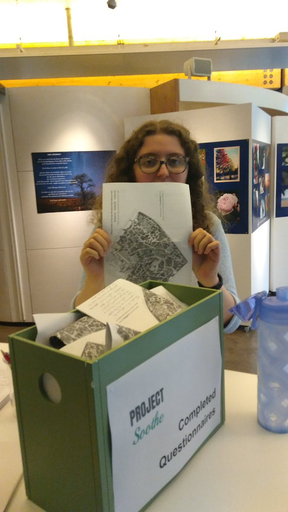

# Education

## PhD, Implementation Science, University of Glasgow

My PhD research (commenced October 2017) examines process evaluation within complex digital interventions for psychosis, utilising the EMPOWER trial as a case study. I presented analysis performed during my first year at the International Conference on Early Intervention in Mental Health in Boston October 2018. This was part of a symposium on service user involvement which is the mainstay of my work.

<a href="https://empowerstudy.net/"> EMPOWER </a> is an innovative research project which aims to develop and evaluate an App for use with adults who experience psychosis. 

## MA(SocSci) Psychology 1.1, University of Glasgow

I graduated in 2017. My final year project explored mental health staff perceptions of digital technology in managing psychosis, jointly supervised by professors Andrew Gumley and Stephany Biello. This work was also completed within EMPOWER. I presented the results at The International Society for Research on Internet Interventions (ISRII) conference in Berlin October 2017.

I was a joint winner of the Pickford Prize for best performance in social psychology for the class of 2017. 

## Research Assistant Experience 

August 2017 - Present [Project Soothe](http://www.projectsoothe.com/) (University of Edinburgh)

Assisting with public engagement activities, social media and maintaining the website.

 <a class="twitter-timeline" 
href="https://twitter.com/ProjectSoothe" 
data-chrome="nofooter"
data-link-color="#820bbb"
data-width="600"
data-height="400"
data-border-color="#ffffff">
Project Soothe Tweets
</a> 

## Training & Skills

| Skill               | Details                                                                                                           |
|---------------------|-------------------------------------------------------------------------------------------------------------------|
| Qualitative Methods | Grounded Theory and Thematic Analysis. Additionally, transcribing large volumes of data |
| Systematic Reviews  | Following PRISMA guidelines.                                                                                      |
| Coding              | I learned HTML and Javascript with [Code First Girls](http://www.codefirstgirls.co.uk)                             |
| Statistics          | Network Analysis.                                                                                            |

