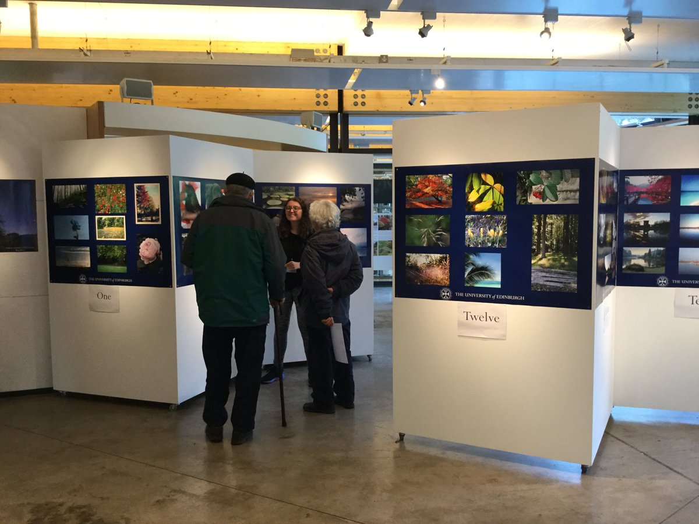

# Education

## PhD, Implementation Science, University of Glasgow

My PhD research (commenced October 2017) examines process evaluation within complex digital interventions for psychosis, utilising the EMPOWER trial as a case study.

<a href="https://empowerstudy.net/"> EMPOWER </a> stands for Early signs Monitoring to Prevent relapse in psychosis and prOmote Wellbeing, Engagement and Recovery. It is an innovative research project which aims to develop and evaluate an App for use with adults who experience psychosis. The App will enable routine self-monitoring for a variety of different experiences, including psychotic experiences (e.g. hearing voices, experiencing suspicious thoughts), anxiety, mood and self-esteem.

## MA(SocSci) Psychology (first class), University of Glasgow

I graduated in 2017. My final year project explored mental health staff perceptions of digital technology usage in managing psychosis, jointly supervised by professors Andrew Gumley and Stephany Biello. This work was also completed within EMPOWER. I presented the results at The International Society for Research on Internet Interventions (ISRII) in Berlin.

I was a joint winner of the Pickford Prize for best performance in social psychology for the class of 2017.

## Research Assistant Experience 

August 2017 - Present [Project Soothe](http://www.projectsoothe.com/) (University of Edinburgh)

## Training & Skills

| Skill               | Details                                                                                                           |
|---------------------|-------------------------------------------------------------------------------------------------------------------|
| Qualitative Methods | Grounded Theory and Thematic Analysis. Additionally, transcribing large volumes of data |
| Systematic Reviews  | Following PRISMA guidelines.                                                                                      |
| Coding              | I am currently learning code with [Code First Girls](http://www.codefirstgirls.co.uk)                             |
| Statistics          | Basic statistics in R.                                                                                            |

## Mental Health Campaigning

I have spoken about my experiences of accessing mental health sevices at academic conferences and in the media. More recently I have volunteered my time to assisting in the development of psychosocial training materials for mental health professionals. I am a proud member of [Time & Space](http://timeandspace.moonfruit.com) - a support group for people who hear voices and/or self-harm in Glasgow.

